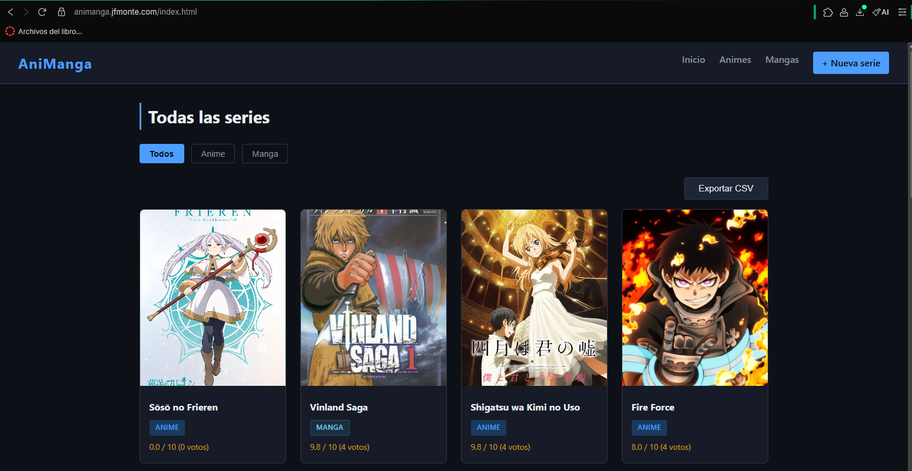

# AniManga Frontend

Frontend de la aplicacion AniManga hecho con HTML, CSS y JavaScript vanilla. Consume la API REST del backend para listar series, ver detalles, agregar capitulos, comentarios, ratings y trabajar con portadas.

## 1. Enlaces Importantes

- Link al deploy: https://animanga.jfmonte.com
(hosting en render, las imágenes pueden desaparecer cada cierto tiempo porque el storage es de plan de paga y no quise guardarlas en base64😅, pero puedes subir nuevas imágenes y estarán ahí hasta que render decida eliminarlas)

- Link al otro repositorio: https://github.com/24750Montenegro/proy1-animanga-backend
- Link a este repositorio: https://github.com/24750Montenegro/proy1-animanga-frontend

## 2. Instrucciones de Ejecucion Local

Este frontend no requiere instalacion de dependencias ni proceso de build porque esta hecho con HTML, CSS y JavaScript puro.

1. Clona el repositorio del frontend.
2. Verifica que el backend este corriendo en `http://localhost:3000`, ya que `js/api.js` apunta a esa URL base.
3. Abre el proyecto de una de estas formas:

Windows:

- Abrir `index.html` directamente desde el explorador.
- Abrir la carpeta en VS Code y usar la extension Live Server sobre `index.html`.

Linux:

- Abrir `index.html` directamente desde el explorador de archivos o con `xdg-open index.html`.
- Abrir la carpeta en VS Code y usar la extension Live Server sobre `index.html`.

Si en algun momento cambias la URL del backend, actualiza `js/api.js` con la nueva direccion de la API.

## 3. Screenshot de la Aplicacion

## 4. Configuracion de CORS

CORS es un middleware que agrega encabezado a las peticiones restringiendo los origenes, es decir quienes pueden realizarlas y quienes no.

Para que este frontend pueda consumir la API REST, en el backend se habilito CORS usando el middleware `cors()` de Express.

## 5. Lista de Challenges Implementados

- Spec OpenAPI/Swagger y Swagger UI sirviendose.
- Retorno de codigos HTTP correctos.
- Validacion de errores Server-Side con JSON.
- Exportar los datos a CSV a mano.
- Sistema integral de Ratings (Puntuacion).
- Funcionalidad para adjuntar y subir archivos de imagen (Portada).

## 6. Reflexion de la Tecnologia

Usar HTML, CSS y JavaScript vanilla en el frontend me parecio bien para entender mejor como funciona todo sin librerias, pero tambien se siente un poco cansado tener que hacer los `fetch()` manualmente y renderizar la informacion recorriendo arreglos con `forEach`, `innerHTML` y `appendChild`. Creo que lo mas interesante de esta parte fue el manejo y la subida local de imagenes, porque anteriormente solo habia trabajado con servicios de storage como Cloudinary o guardando imagenes en base64. En cuanto al backend, mi stack fue principalmente Node.js con Express y CORS, y me parece un muy buen stack que ya habia utilizado antes y que seguramente seguire usando bastante, porque considero que segmenta muy bien las responsabilidades entre controladores, rutas y middlewares. Otra cosa que me gusto bastante fue usar Swagger UI para documentar los endpoints, porque hace mucho mas facil visualizar, probar y entender la API. Si volviera a hacer un proyecto nuevo, si reutilizaria el stack del backend, pero para el frontend preferiria usar librerias como React y Axios para facilitar todo el tema del mapeo de informacion y la normalizacion de solicitudes. Los challenges tambien sirvieron para reforzar temas como validaciones, codigos HTTP, exportacion a CSV y documentacion de la API.
